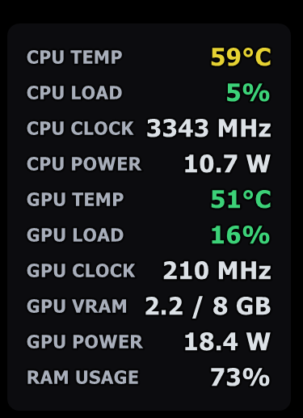
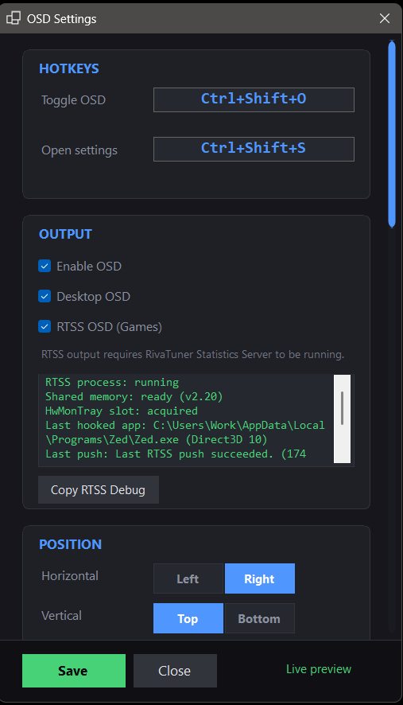

# PC Stats Tray

[](https://github.com/Avaxerrr/pc-stats-tray/actions/workflows/build-release.yml)
[](https://avaxerrr.github.io/pc-stats-tray/)


PC Stats Tray is a small Windows app that shows hardware stats in simple places you can actually see:

- in the tray icon
- on the desktop
- inside games, if you want that

If you want a lightweight monitor instead of a big dashboard always open, this is what the app is for.

## What it looks like

### Desktop overlay



### OSD settings



## Start here

To use the app, you may need these downloads:

- `Website`: [Open the landing page](https://avaxerrr.github.io/pc-stats-tray/)
- `App download`: [Download the latest release](https://github.com/Avaxerrr/pc-stats-tray/releases/latest)
- `.NET 10 Desktop Runtime`: [Download from Microsoft](https://dotnet.microsoft.com/en-us/download/dotnet/10.0)
- `RTSS`: [Download RivaTuner Statistics Server](https://www.guru3d.com/download/rtss-rivatuner-statistics-server-download/)

What these mean:

- `App download` is the ready-to-run exe from the GitHub Releases page
- `.NET 10 Desktop Runtime` is something Windows may need before the app can open
- `RTSS` is only needed if you want the overlay to appear inside games

If you only want the tray icon and desktop overlay, you do not need RTSS.

## Quick setup

1. Install the `.NET 10 Desktop Runtime` from Microsoft.
2. Run `PCStatsTray.exe`.
3. Right-click the tray icon.
4. Open `OSD Settings`.
5. Choose the metrics you want.
6. Turn on `Desktop OSD` if you want stats on your desktop.
7. Turn on `RTSS OSD (Games)` only if RTSS is installed and open.
8. Click `Save`.

## Want stats inside games?

Do this:

1. Install RTSS.
2. Open RTSS.
3. In RTSS, make sure `Show On-Screen Display` is turned on.
4. Open PC Stats Tray.
5. In `OSD Settings`, turn on `RTSS OSD (Games)`.

Simple explanation:

- PC Stats Tray gets the temperatures and usage data
- RTSS is the thing that draws those stats inside the game
- if `Show On-Screen Display` is off in RTSS, nothing will appear in-game even if PC Stats Tray is working correctly

## Want stats only on the desktop?

Do this:

1. Run PC Stats Tray.
2. Open `OSD Settings`.
3. Turn on `Desktop OSD`.
4. Leave `RTSS OSD (Games)` off.

## If the app does not open

The most common reason is that the `.NET 10 Desktop Runtime` is not installed yet.

Install that first, then try again.

## What the app can do

- show a live temperature in the tray icon
- show a desktop OSD with the metrics you choose
- send the same metrics to RTSS for supported in-game overlays
- let you change font, size, shadow, outline, position, and visibility
- support hotkeys for toggling the OSD and opening settings

## Technical details

PC Stats Tray is built with:

- .NET 10
- WinForms
- LibreHardwareMonitor-related binaries for hardware data collection

## Automatic builds and releases

GitHub Actions is set up for this repo now:

- every push and pull request runs a Windows build and the unit tests
- every tag that starts with `v` builds the one-file Windows exe
- that tagged build is uploaded to GitHub Releases automatically

Example release tag:

```text
v0.4.0
```

That release uploads a file named like:

```text
PCStatsTray_v0.4.0_win-x64.exe
```

## Credits

PC Stats Tray uses LibreHardwareMonitor-related binaries for hardware monitoring support.

Credit and third-party notice files are included in:

- `PCStatsTray/docs/LibreHardwareMonitor-LICENSE.txt`
- `PCStatsTray/docs/LibreHardwareMonitor-THIRD-PARTY-NOTICES.txt`

Project folders:

- `PCStatsTray/` main Windows app
- `PCStatsTray.Tests/` unit tests
- `PCStatsTray/lib/` local dependency DLLs used by the app
- `PCStatsTray/docs/` third-party license and notice files

## Build from source

```powershell
dotnet build .\PCStatsTray\PCStatsTray.csproj
dotnet test .\PCStatsTray.Tests\PCStatsTray.Tests.csproj
```

## Publish

Current publish command:

```powershell
dotnet publish .\PCStatsTray\PCStatsTray.csproj -c Release -r win-x64 -p:PublishSingleFile=true -p:SelfContained=false
```

Output:

```text
PCStatsTray/bin/Release/net10.0-windows/win-x64/publish/PCStatsTray.exe
```

This is a single-file publish, but it still requires the .NET 10 Desktop Runtime on the target PC.

## License

This project is released under the MIT License. See [LICENSE](LICENSE).

The MIT license applies to PC Stats Tray itself. Third-party components keep their own upstream notices and license terms.
